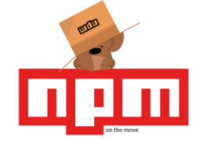
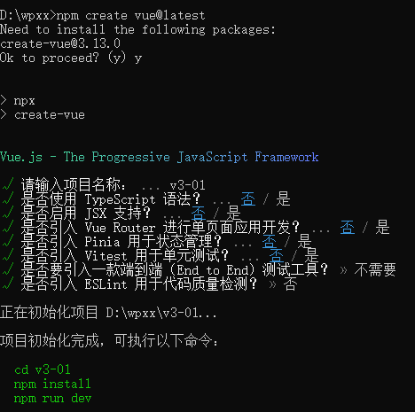

# 复习

onmouseenter / onmouseleave

onmouseover / onmouseout

onselect

onsubmit（提交，form）

onunload（兼容性问题，路由切换再讲）

removeEventListener移除事件

# 定时器

# es6语法
es和js的关系

javascript
    vbscript

ECMAScript，ecma标准（复制了）
es3 es5 es6
import(工具编译，babel)
# 样式补充
表单轮廓
outline:none

# color
# 跳过的内容

in运算符
字符串，数组互转
alert()
confirm()
prompt()

# nodejs环境搭建

v-18环境

## npm

国外有一家 IT 公司叫做 npm, Inc. 它开发了一个网站，是全球最大的包共享平台，到目前为止，全球约 1100 多万的开发人员，通过这个包共享平台，开发并共享了超过 120 多万个包供我们使用。

 

网站地址：https://www.npmjs.com

## 切换镜像源：

//查看包来源：

npm config get registry

 

//切换包来源：

npm config set registry=来源地址

npm config set registry=https://registry.npmmirror.com/

# vue

## 创建项目

npm create vue@latest

