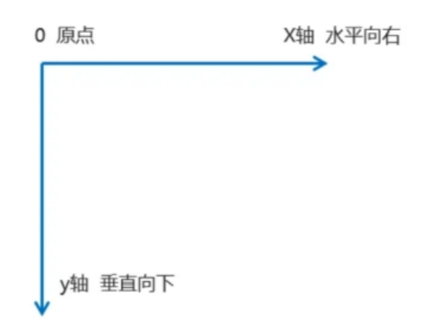

# 数组控制样式

记得加value

# v-model

input v-model="abc"    input - text,password radio   textarea  select

checkbox   必须是arr数组


## MVVM数据视图的双向绑定

m - model 

v - view (html + css)

vm (view<->model)


mvc

c(ctrol)

=======

# es6导入导出

es6提供了一套模块化解决方案，但是这套方案比较新，大部分浏览器还不支持它，不过有了babel，我们可以把它编译为nodejs、浏览器认识的js代码。

## 导出

es6的导出比较灵活，有如下3种办法：

1，分别导出

2，统一导出

3，默认导出

### 分别导出

新建文件car.js，此文件用于向外单个导出变量和方法。

```js
//导出变量
export var name = '法拉利';
export var red= 'red';
//导出普通函数
export function say(){
  console.log(“滴2”);
};
//导出箭头函数
export var say = ()=>{
  console.log(“滴1”);
};
```


### 统一导出

新建文件car.js，此文件用于向外批量导出变量和方法，导出的同时，还可以更换变量的名字。

```js
var age = 3;
var say = ()=>{
  console.log(“喵！”);
}
export {
  //导出age
  age,
  say
}
```

### 默认导出

```js
export default 3.14

```


## 导入

es6的导入比较简单，通过import和from关键词导入外部模块。

语法：import 默认变量,{变量1，变量2} from “路径/模块名”

新建文件main.js，此文件用于导入变量和方法。

路径/模块名中的路径./不可省略，模块名的后缀名可以省略。

例如：

import car from “./src/car”

###  导入单个变量

可以根据需要，导入单个变量，目标模块导出的变量，根据需要导入

import {color} from "./car.js";

### 导入多个变量

import {color,name} from "./car.js";

### 导入默认变量

导入的默认变量，名字随便取（遵循变量名命名规则）

import color from "./car.js";

# localStorage简介

localStorage可以将数据永久存储到本地，除非主动删除，或者清除浏览器缓存，空间大小：5M，只能存储字符串。

localStorage属于永久性存储，如果存储内容多的话会消耗内存空间，会导致页面卡顿。

## localStorage使用

1，存储写入

 localStorage.setItem(key,data)；

localStorage.setItem(“x1”,”hello localStorage”)；

 

2，存储读取

 localStorage.getItem(key)；

若找不到，就返回null。

localStorage.getItem(“x1”)；

 

若找不到数据，得到null

 

3，删除数据

1）删除指定数据：localStorage.removeItem("x1");

2）删除所有数据：localStorage.clear(); 

 

 

4，点语法操作

localStorage.age = 78;//存入

var a = localStorage.age;//读取

delete localStorage.age;//删除

 

注：localStorage遵循同源策略

 

## 同源策略 - 跨域

同源策略，指的是当两个网页的协议、域名、端口号保持一致的时候，可以互相访问彼此的资源，否则属于跨域访问，会被浏览器禁止。

 

例如：

http://192.168.60.105:8080

https://www.baidu.com:40

 

http://www.baidu.com

http://www.qq.com

### 协议

http，https，网络传输协议

### 域名/ ip地址

192.168.60.105，IP地址，或者域名

### 端口号（\*）

通过端口号，一个服务器可以提供很多不同的服务，不同的端口，一般用于不同的服务内容。

 

常见的端口号有：

3000：网页的浏览

8080：网页的浏览

8081：网页的浏览

8082：网页的浏览

8083：网页的浏览

3306：MySQL数据库对外提供服务的端口。

21：FTP服务所开放的端口，用于上传、下载文件。

23：Telnet端口，用于Telnet[远程登录](https://so.csdn.net/so/search?q=远程登录&spm=1001.2101.3001.7020)服务器。

110：POP3用于POP3 协议，POP3 是电子邮件收发的协议。

# css3常用样式

## 过渡动画

CSS3 过渡动画，指的是元素从一种样式，逐渐改变为另一种的效果。

语法：transition:属性名1 动画时间1,属性名2 动画时间2;

```css
.box{
	width: 200px;
	transition: width 1s;
}
.box:hover{
	width: 400px;
}
```

ps：如果动画不生效，就显示的声明具有动画效果的css属性

## transform，2d转换

Transform属性应用于元素的2D、3D转换。这个属性允许我们将元素旋转，缩放，移动，倾斜等，经过transform处理的元素，旧位置保留，新位置不会对别的元素有影响。

2d坐标轴如下：

 

### translate移动

相对于元素本身的位置，这一点，和relative相似

```css
transform: translate( x , y ) ; /*批量设置x、y*/

transform: translateX( x ) ; /*单独设置x*/

transform: translateY( y ) ; /*单独设置y*/
```

x，y的值可以为px，或者%，当为%时，是相对于元素自身尺寸的百分比。

例如：
```css
.x1{
    transform: translate( 10px , 0 );
}
```

**translate和relative的区别：**

1，translate是css3新特性，兼容性不好

2，使用 transform 时，可以让 GPU 参与运算，动画的 FPS 更高（硬件加速）

### rotate旋转

定义 2D 旋转，在参数中规定角度，注意角度的单位是deg。

```css
transform: rotate(45deg);//平行于屏幕旋转
transform: rotateX(45deg);//沿着x轴旋转
transform: rotateY(45deg);//沿着y轴旋转
```


 

### scale缩放

通过scale，可以对元素大小进行缩放，有2种写法：

```css
transform: scale(0.5)；/*宽高都变为原来的0.5倍*/
transform: scale(1, 2)；/*宽高分别变为原来的1 、 2倍*/
```


 